<div align="center">


<h1>Zero Trust Reference Architecture</h1>

<p><strong>The Strategic Foundation for Enterprise Zero Trust Adoption, Modular Implementation Patterns, and Standardized Security Architectures using Infrastructure as Code</strong></p>

[]()
[]()
[]()

<br/>

> **"A reference architecture is only as good as its implementation."** 
> Zero Trust Reference Architecture (ZT-Ref) is an enterprise-grade platform designed to provide a secure, measurable, and highly automated foundation for global security transformation. It orchestrates the complex lifecycle of Zero Trust adoption—from modular identity patterns and network models to standardized application security baselines, data protection frameworks, and unified security governance. By providing a centralized command center with unified reference-as-code patterns, automated deployment pipelines, and immutable architecture logs, it enables organizations to eliminate security fragmentation, ensure consistent Zero Trust maturity, and drive secure digital transformation across the entire enterprise ecosystem.

</div>

---

## 🏛️ Executive Summary

Fragmented security implementations and lack of standardized patterns are strategic operational liabilities; lack of a comprehensive reference architecture is a primary barrier to enterprise Zero Trust maturity. Organizations fail to adopt Zero Trust not because of a lack of tools, but because of fragmented implementation standards, lack of automated pattern validation, and an inability to architect secure systems with operational precision.

This platform provides the **Security Architecture Intelligence Plane**. It implements a complete **Enterprise Reference-as-Code Framework**—from modular Identity and Network patterns to specialized AppSec and Data protection hubs. By operationalizing Zero Trust as a primary architectural pillar, it ensures that your global security stack is not just "planned," but continuously optimized and delivered with strategic performance-aligned precision.

---

## 🏛️ Core Platform Pillars

1. **Modular Identity Patterns**: High-performance reference implementations for OIDC federation, MFA orchestration, and least-privilege RBAC.
2. **Network Security Models**: Carrier-grade patterns for micro-segmentation, secure access proxies, and mTLS-enforced service meshes.
3. **Application Security Baseline**: Intelligent orchestration of API security patterns, token-based access control, and secure coding frameworks.
4. **Data Protection Framework**: Advanced modeling of encryption-at-rest/transit, data classification, and access control policies.
5. **Continuous Governance Registry**: Carrier-grade engine for central policy definition, automated compliance validation, and audit trail persistence.
6. **Unified Reference Dashboard**: Deep observability into adoption maturity, pattern coverage, and global security distribution.

---

## 📐 Architecture Storytelling: 50+ Advanced Diagrams

### 1. The Reference-to-Reality Loop
*The flow from reference pattern definition to production security operations.*
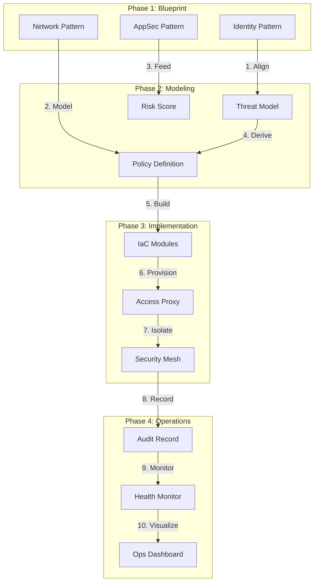

### 2. Multi-Layered Zero Trust Topology
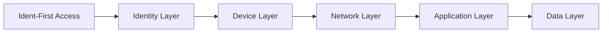

### 3. Policy Evaluation Reference Flow
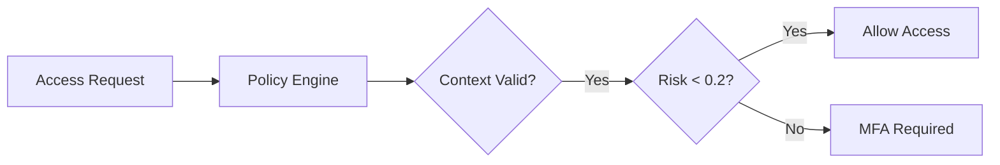

### 4. Zero Trust Reference Architecture
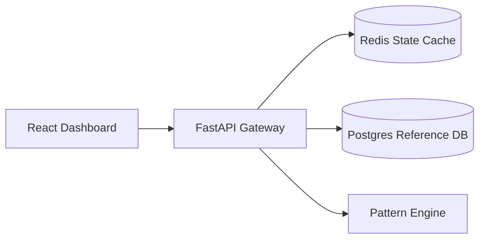

### 5. Deployment Topology: Regional Reference Hub
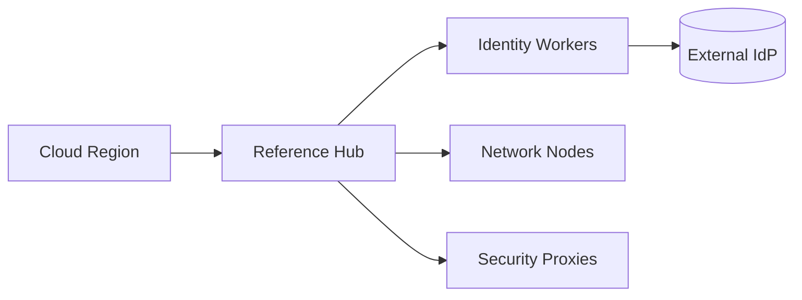

### 6. Continuous Verification Model
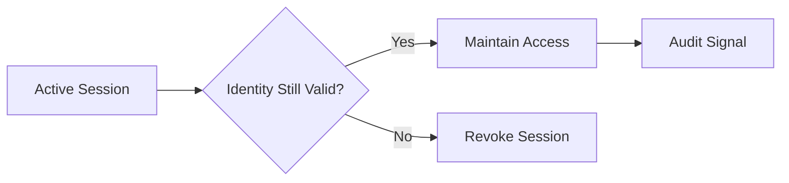

### 7. Foundation: Multi-Environment Setup
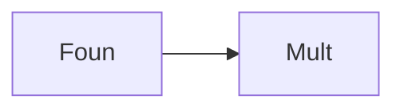

### 8. Networking: Secure Transit Mesh
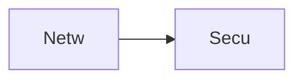

### 9. Component: Identity Pattern Engine
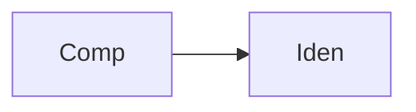

### 10. Component: Network Model Hub
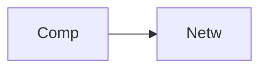

### 11. Component: AppSec Baseline
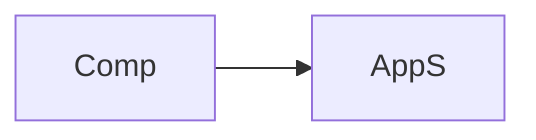

### 12. Component: Data Protection Engine
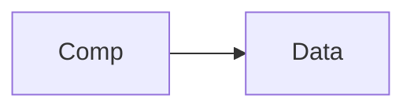

### 13. Logic: JWT Validation Flow
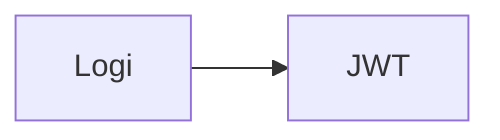

### 14. Logic: Conditional Access Logic
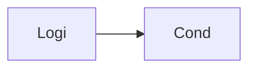

### 15. Logic: Micro-segmentation Rules
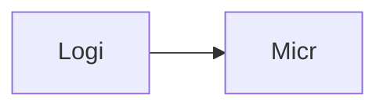

### 16. Logic: Automated Threat Mitigation
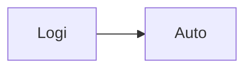

### 17. Architecture: Global Reference Plane
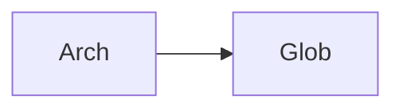

### 18. Architecture: Security Topology Mesh
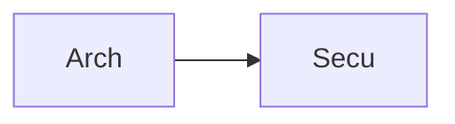

### 19. Architecture: Multi-Sink Reporting
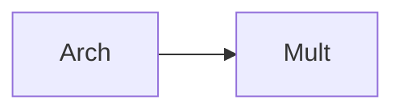

### 20. Pattern: Zero-Trust-as-Code
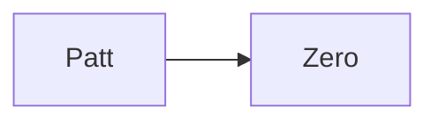

### 21. Pattern: Immutable Target Zones
```mermaid
graph LR
    P[Patt] --> I[Immu]
```

### 22. Pattern: Least Privilege ABAC
```mermaid
graph LR
    P[Patt] --> Leas[Leas]
```

### 23. Security: Signed Reference Artifacts
```mermaid
graph LR
    S[Secu] --> S[Sign]
```

### 24. Security: RBAC Pattern Management
```mermaid
graph LR
    S[Secu] --> R[RBAC]
```

### 25. Security: Secure Audit Record
```mermaid
graph LR
    S[Secu] --> S[Secu]
```

### 26. Feature: Adoption Heatmap UI
```mermaid
graph LR
    F[Feat] --> A[Adop]
```

### 27. Feature: Real-time Velocity Tailing
```mermaid
graph LR
    F[Feat] --> R[Real]
```

### 28. Feature: Auto-generated PCAPs
```mermaid
graph LR
    F[Feat] --> A[Auto]
```

### 29. Compliance: NIST 800-207 Mapping
```mermaid
graph LR
    C[Comp] --> N[NIST]
```

### 30. Compliance: Audit Trail Persistence
```mermaid
graph LR
    C[Comp] --> A[Audi]
```

### 31. Infrastructure: Redis State Cache
```mermaid
graph LR
    I[Infr] --> R[Redi]
```

### 32. Infrastructure: Postgres Reference DB
```mermaid
graph LR
    I[Infr] --> P[Post]
```

### 33. Deployment: Kubernetes Reference Pods
```mermaid
graph LR
    D[Depl] --> K[Kube]
```

### 34. Deployment: Multi-Region Pattern Sync
```mermaid
graph LR
    D[Depl] --> M[Mult]
```

### 35. Monitoring: verification velocity KPI
```mermaid
graph LR
    M[Moni] --> V[Veri]
```

### 36. Monitoring: policy compliance KPI
```mermaid
graph LR
    M[Moni] --> P[Poli]
```

### 37. UI: Unified Reference Dashboard
```mermaid
graph LR
    U[UI] --> U[Unif]
```

### 38. UI: Pattern Library UI
```mermaid
    U[UI] --> P[Patt]
```

### 39. UI: ROI View
```mermaid
graph LR
    U[UI] --> R[ROIV]
```

### 40. UI: Readiness Heatmap
```mermaid
graph LR
    U[UI] --> R[Read]
```

### 41. CI/CD: Pattern validation pipeline
```mermaid
graph LR
    C[CICD] --> P[Patt]
```

### 42. CI/CD: Reference engine tests
```mermaid
graph LR
    C[CICD] --> R[RefE]
```

### 43. Strategy: Pattern-First Security
```mermaid
graph LR
    S[Stra] --> P[Patt]
```

### 44. Strategy: Data-Driven Adoption
```mermaid
graph LR
    S[Stra] --> D[Data]
```

### 45. Feature: Multi-Cloud Search Bridge
```mermaid
graph LR
    F[Feat] --> M[Mult]
```

### 46. Feature: Real-time Outage Alerts
```mermaid
graph LR
    F[Feat] --> R[Real]
```

### 47. Feature: Threat Forecasting
```mermaid
graph LR
    F[Feat] --> T[Thre]
```

### 48. Logic: Cost Comparison Engine
```mermaid
graph LR
    L[Logi] --> C[Cost]
```

### 49. Data Model: Reference Task Entity
```mermaid
graph LR
    D[Data] --> R[Refe]
```

### 50. Enterprise Reference Excellence
```mermaid
graph LR
    E[Entr] --> E[Refe]
```

---

## 🛠️ Technical Stack & Implementation

### Platform Engine & APIs
- **Framework**: Python 3.11+ / FastAPI.
- **Pattern Engine**: High-performance orchestration of identity, network, and app patterns.
- **Proxy Hub**: Secure access proxy implementation for application-level control.
- **Threat Engine**: Behavioral analytics simulation and anomaly detection.
- **Cache**: Redis for session tracking and real-time pattern status updates.
- **Persistence**: PostgreSQL for reference metadata, access logs, and audit trails.
- **Observability**: Prometheus/Grafana integration for reference factory monitoring.

### Frontend (Reference Command Center)
- **Framework**: React 18 / Vite.
- **Theme**: Cyan / Teal (Modern Security & Architecture aesthetic).
- **Visualization**: Recharts for adoption trends and pattern coverage.

### Infrastructure
- **Runtime**: AWS EKS (Kubernetes).
- **Deployment**: Helm charts for reference workers and security gateways.
- **IaC**: Terraform (Modular with Security Reference focus).

---

## 🚀 Deployment Guide

### Local Development
```bash
# Clone the repository
git clone https://github.com/devopstrio/zero-trust-reference.git
cd zero-trust-reference

# Setup environment
cp .env.example .env

# Launch the Reference stack (API, Engines, DB, Redis, UI)
make up

# Simulate an adoption flow
make simulate

# Enforce reference baseline policies
make enforce

# Validate reference architecture
make test
```
Access the Reference Dashboard at `http://localhost:3000`.

---

## 📜 License
Distributed under the MIT License. See `LICENSE` for more information.
