<div align="center">


<h1>Zero Trust Reference Architecture</h1>

<p><strong>The Strategic Foundation for Enterprise Zero Trust Adoption, Modular Implementation Patterns, and Standardized Security Architectures.</strong></p>

[]()
[]()
[]()

<br/>

> **"A reference architecture is only as good as its implementation."** 
> **Zero Trust Reference Architecture** is an enterprise-grade platform designed to provide a secure, measurable, and highly automated foundation for global security transformation. It orchestrates the complex lifecycle of Zero Trust adoption—from modular identity patterns and network models to standardized application security baselines.

</div>

---

## 🏛️ Executive Summary

Fragmented security implementations and lack of standardized patterns are strategic operational liabilities; lack of a comprehensive reference architecture is a primary barrier to enterprise Zero Trust maturity. Organizations fail to adopt Zero Trust not because of a lack of tools, but because of fragmented implementation standards, lack of automated pattern validation, and an inability to architect secure systems with operational precision.

This platform provides the **Security Architecture Intelligence Plane**. It implements a complete **Enterprise Reference-as-Code Framework**, enabling Architects and Security leads to manage the zero-trust journey as a first-class citizen. By automating the validation of reference patterns and orchestrating real-time maturity audits, we ensure that every organizational asset—from user identities to sensitive data lakes—is architected for security by default, audited for history, and strictly aligned with institutional compliance frameworks.

---

## 📐 Architecture Storytelling: Principal Reference Models

### 1. Principal Architecture: Global Zero Trust Reference Architecture & Strategic Control Plane
This diagram illustrates the end-to-end flow from architectural assessment and pattern selection to automated implementation, compliance gating, and institutional maturity auditing.

```mermaid
graph LR
    %% Subgraph Definitions
    subgraph AssessmentHub["Architectural Assessment"]
        direction TB
        Gap["Gap Analysis (NIST/CISA)"]
        Blueprint["Pattern Blueprint Catalog"]
        Maturity["Maturity Baseline (Crawl)"]
    end

    subgraph IntelligenceEngine["Strategic Intelligence Hub"]
        direction TB
        API["FastAPI Reference Gateway"]
        Planner["Pattern Resolver Engine"]
        Validator["Architecture Policy Gater"]
        Orchestrator["Implementation Orchestrator"]
    end

    subgraph PatternPlane["Standardized ZT Pillars"]
        direction TB
        Identity["Unified Identity (OIDC)"]
        Network["Micro-Segmented Fabric"]
        Workload["Hardened Cloud Services"]
    end

    subgraph OperationsHub["Institutional Maturity Hub"]
        direction TB
        Scorecard["Maturity & Coverage Score"]
        Roadmap["Phased Adoption Analytics"]
        Audit["Forensic Architecture Lake"]
    end

    subgraph DevOps["Reference-as-Code Orchestration"]
        direction TB
        TF["Terraform Pattern Modules"]
        Registry["Service & Pattern Catalog"]
        AuditSvc["Continuous Compliance Audit"]
    end

    %% Flow Arrows
    AssessmentHub -->|1. Submit Blueprint| API
    API -->|2. Resolve Implementation| Planner
    Planner -->|3. Verify Pattern| Validator
    Validator -->|4. Execute Pattern| Orchestrator
    
    Orchestrator -->|5. Deploy Identity| Identity
    Identity -->|6. Harden Fabric| Network
    Network -->|7. Secure Workload| Workload
    
    API -->|8. Visualize Maturity| Scorecard
    Scorecard -->|9. Model Roadmap| Roadmap
    Scorecard -->|10. Record Result| Audit
    
    TF -->|11. Provision Hub| IntelligenceEngine
    Registry -->|12. Select Components| Orchestrator
    Audit -->|13. Refine Reference| AssessmentHub

    %% Styling
    classDef assessment fill:#f5f5f5,stroke:#616161,stroke-width:2px;
    classDef intel fill:#e1f5fe,stroke:#01579b,stroke-width:2px;
    classDef patterns fill:#ede7f6,stroke:#311b92,stroke-width:2px;
    classDef ops fill:#e0f2f1,stroke:#004d40,stroke-width:2px;
    classDef devops fill:#fffde7,stroke:#f57f17,stroke-width:2px;

    class AssessmentHub assessment;
    class IntelligenceEngine intel;
    class PatternPlane patterns;
    class OperationsHub ops;
    class DevOps devops;
```

### 2. The Zero Trust Maturity Lifecycle Flow
The continuous path of an architecture from initial assessment and architectural design to active implementation, auditing, and institutional optimization.

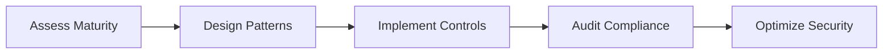

### 3. Core Zero Trust Pillars Pattern
Standardizing the implementation of the six key pillars of Zero Trust—Identity, Device, Network, Application, Data, and Visibility—into a unified reference model.

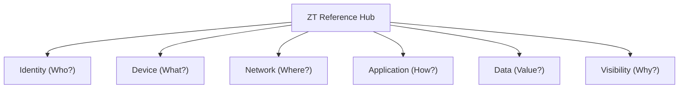

### 4. Phased Adoption Roadmap (Crawl, Walk, Run)
Orchestrating the transition from legacy perimeter-based security to full identity-driven micro-segmentation through manageable, risk-reducing phases.

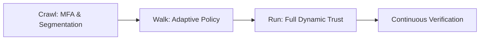

### 5. Multi-Cloud Reference Identity Mesh
Strategically standardizing identity federation and RBAC across Azure, AWS, and Google Cloud to ensure a single, consistent security posture regardless of the provider.

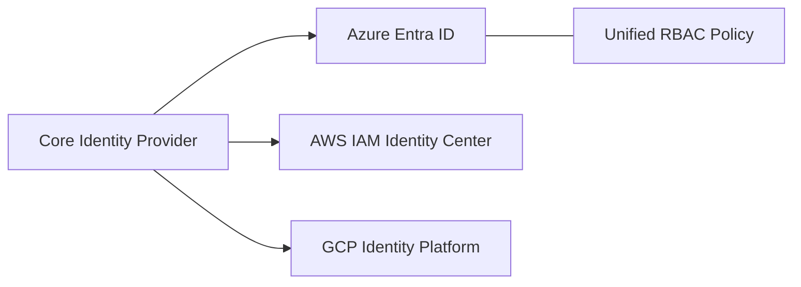

### 6. Secure Workload Reference Model
Standardizing the hardening patterns for Kubernetes clusters, serverless functions, and virtual machine scale sets to ensure consistent workload security.

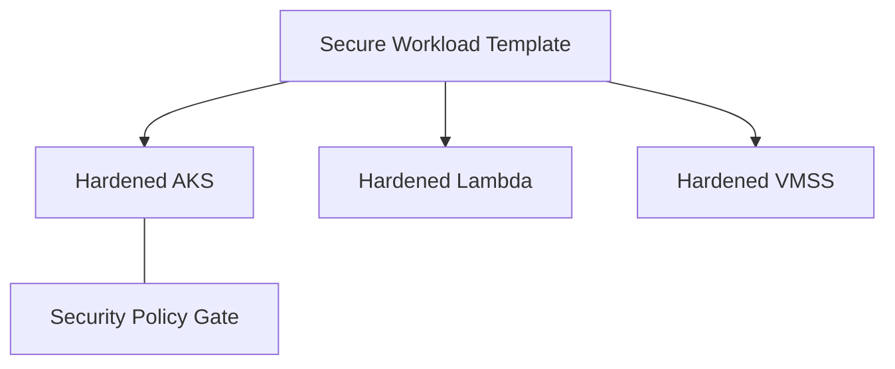

### 7. Data Security & Privacy Reference Hub
Providing standardized patterns for encryption-at-rest, data tokenization, and data loss prevention (DLP) across global cloud storage and database services.

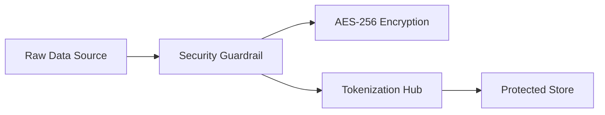

### 8. Institutional Zero Trust Maturity Scorecard
Grading organizational performance against the reference architecture based on key indicators: Pattern Coverage, Control Efficacy, and Deployment Speed.

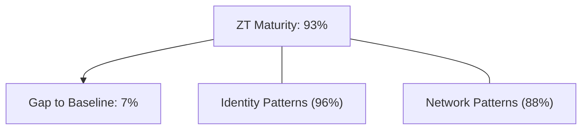

### 9. Identity & RBAC for Architectural Governance
Managing fine-grained access to reference blueprints, implementation policies, and maturity logs between CTOs, CISOs, and Security Architects.

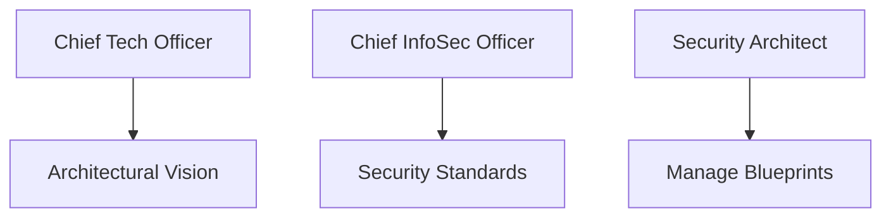

### 10. IaC Deployment: Reference-as-Code Framework
Using modular Terraform to deploy and manage the versioned distribution of the zero-trust reference patterns, implementation workers, and audit lakes.

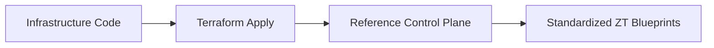

### 11. Metadata Lake for Forensic Pattern Audit
Storing long-term records of every architectural plan, implementation event, and security baseline deviation for institutional record-keeping.

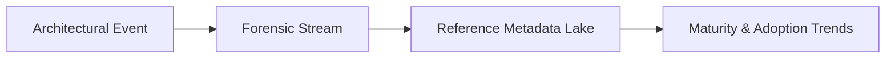

---

## 🏛️ Core Reference Pillars

1.  **Modular Pattern Standardization**: Defining secure, reusable implementation blueprints for all organizational assets.
2.  **Phased Adoption Orchestration**: Managing the strategic transition to zero-trust through risk-aligned phases.
3.  **Multi-Cloud Pattern Consistency**: Ensuring identical security postures across Azure, AWS, and GCP.
4.  **Policy-Based Reference Validation**: Automatically auditing implementations against the institutional baseline.
5.  **Privacy-by-Design Data Fabric**: Standardizing the protection of sensitive data through automated encryption and tokenization.
6.  **Full Architectural Auditability**: Immutable recording of every reference change and implementation for institutional forensics.

---

## 🛠️ Technical Stack & Implementation

### Reference Engine & APIs
*   **Framework**: Python 3.11+ / FastAPI.
*   **Pattern Core**: Custom logic for orchestrating the resolution and implementation of ZT-patterns.
*   **Maturity Evaluator**: Intelligent engine for grading organizational posture against NIST/CISA frameworks.
*   **Governance Hub**: Policy-as-Code (OPA) for auditing infrastructure against reference blueprints.
*   **State Management**: PostgreSQL (Metadata Lake) and Redis (Pattern Cache).

### Reference Dashboard (UI)
*   **Framework**: React 18 / Vite.
*   **Theme**: Cyan, Indigo, Slate (Modern architectural aesthetic).
*   **Visualization**: Recharts for maturity trends, pattern coverage heatmaps, and adoption velocity.

### Infrastructure & DevOps
*   **Runtime**: AWS EKS or Azure Kubernetes Service (AKS).
*   **Blueprints**: Versioned Terraform modules and Helm charts for zero-trust pattern delivery.
*   **IaC**: Modular Terraform for deploying the reference hub and pattern implementation distributions.

---

## 🏗️ IaC Mapping (Module Structure)

| Module | Purpose | Real Services |
| :--- | :--- | :--- |
| **`infrastructure/ref_hub`** | Central management plane | EKS, PostgreSQL, Redis |
| **`infrastructure/identity`** | Standardized Identity patterns | Entra ID, Okta, IAM |
| **`infrastructure/network`** | Standardized Network models | VNet, Mesh, ZTNA |
| **`infrastructure/auditing`** | Forensic maturity sinks | S3, Athena, Quicksight |

---

## 🚀 Deployment Guide

### Local Principal Environment
```bash
# Clone the reference platform
git clone https://github.com/devopstrio/zero-trust-reference.git
cd zero-trust-reference

# Configure environment
cp .env.example .env

# Launch the Reference stack
make init

# Trigger a mock maturity assessment and pattern implementation simulation
make simulate-adoption
```

Access the Reference Dashboard at `http://localhost:3000`.

---

## 📜 License
Distributed under the MIT License. See `LICENSE` for more information.

---
<div align="center">
  <p>© 2026 Devopstrio. All rights reserved.</p>
</div>
